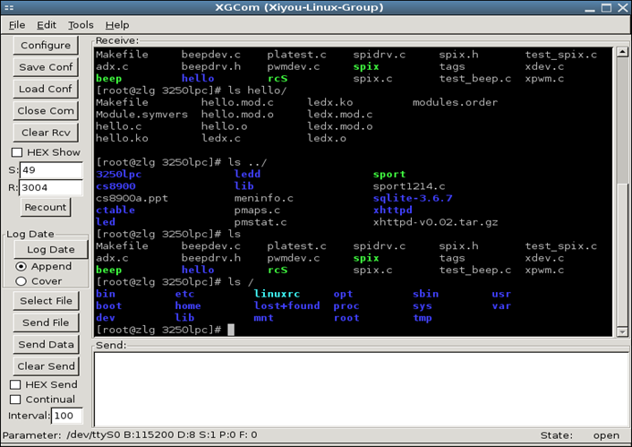
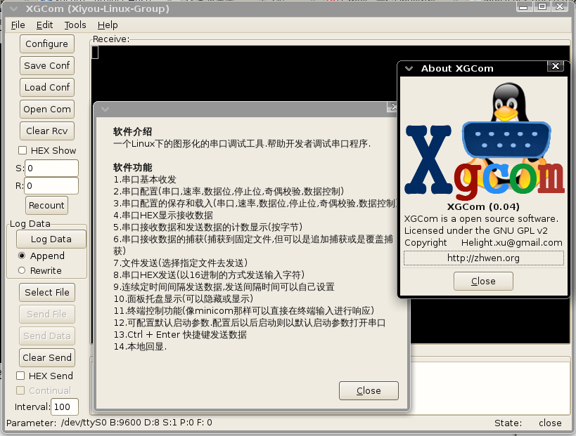

A gui tools to help guys develop series port, like minicom

# Intro：
A gui tools to help guys debug programs remotely by series port, like minicom.
part code is form gtkterm-0.99.5. 

# Features：
	1.send and receive data from com
	2.configure the com (speed,data bit, stop bit, odd bit, contrl data)
	3.sace and load the configure file (speed,data bit, stop bit, odd bit, data contrl)
	4.show the data in HEX format
	5.count the num of receive and send data (by byte)
	6.log the receive data into file (append or cover)
	7.send file (choose and send file)
	8.send data in HEX format 
	9.send data by interval， you can set the time by yourself
	10.show ico in panel (you can show or hide the window by clicking it)
	11.can type character in receive area, (just like minicom)
	12.set the default configure file
	13.local echo.
# get and install

## get source by git:

	git clone https://github.com/helight/xgcom

## get source in tar ball:

	https://github.com/helight/xgcom/releases

## Some lib and tools are needed：
	make, automake，libglib2.0-dev，libvte-dev，libgtk2.0-dev

[zlbgps](http://code.google.com/u/zlbgps) has put this software into AUR pakeage library. so arch users can install this program with this command :

	yaourt -S xgcom

## compile steps:

	xgcom$ ./autogen.sh
	xgcom$ make
	xgcom$ sudo make install
	xgcom$ xgcom

# About：

If you find any bugs, please email us, we will fix it as soon as possible!